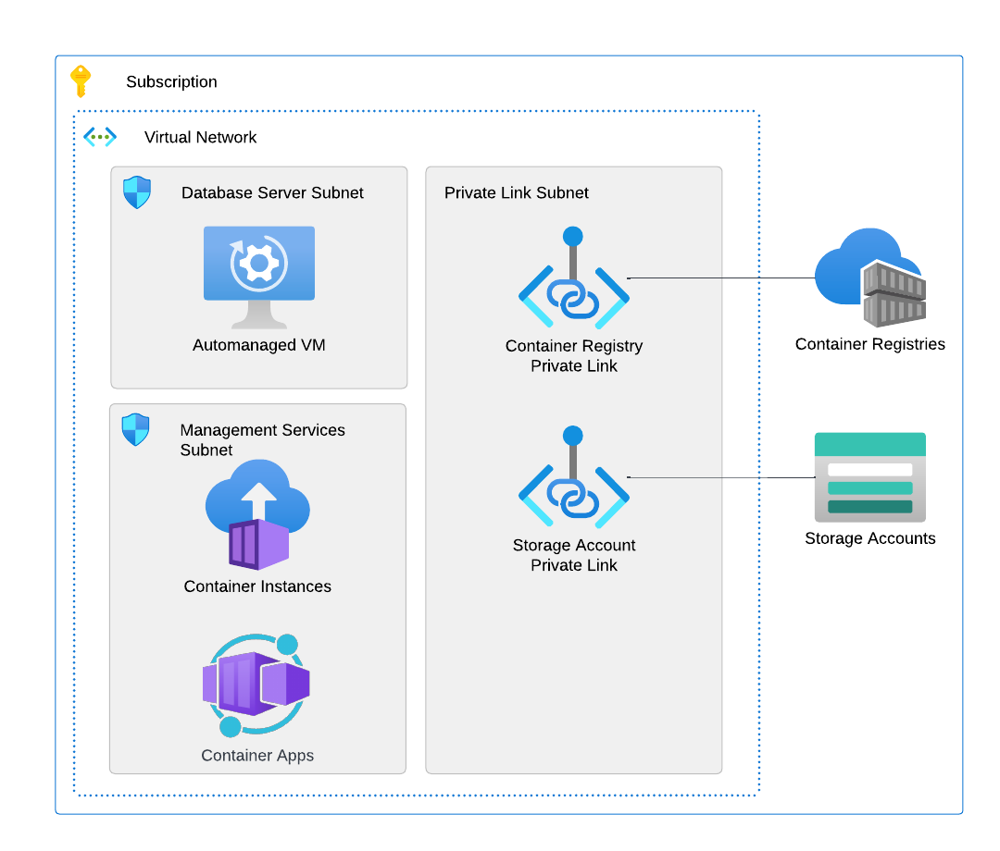

# Azure Percona

This is the repository for my Azure Percona product. Essentially this is the culmination of the tools required to bring up a Percona Server in your Azure environment while trying to remain as maintenance free as possible.

## ✅ Introduction

Recently I was working on a MySQL implementation in Azure I was not happy with the [Azure MySQL Flexible Server](https://learn.microsoft.com/en-us/azure/mysql/flexible-server/overview) implementation from Azure itself and decided to go with MySQL VM instances instead. Of course, this was not the best decision and caused some crazy technical debt which we had to address such as automated backups, performance and management etc. So, I decided that the Percona set of tools for backups, management and monitoring would be a handy product in Azure Market place and I needed something to do.

## ⚙️ Technologies

* Azure marketplace [here](https://github.com/Azure/azure-quickstart-templates/tree/master/demos/100-marketplace-sample)
* Percona Server [here](https://www.percona.com/software/mysql-database/percona-server)
* Percona XtraBackup [here](https://www.percona.com/software/mysql-database/percona-xtrabackup)
* Percona Monitoring and Management [here](https://github.com/percona/pmm)
* Azure Container Instances [here](https://learn.microsoft.com/en-us/azure/container-instances/)
* Azure Container Apps [here](https://learn.microsoft.com/en-us/azure/container-apps/)

## 📃 Architecture

The following diagram shows the architecture as deployed in Azure.

The components in the architecture above are as follows:

1. Azure Linux Virtual Machine with docker installed for the Percona Server (5.7 or 8.1).
2. Azure Container Instance for cron jobs such as backup or indexing.
3. Azure Container Apps for the management user interface.
4. Container registry for the containers.
5. Storage account for the backup storage.

## 🌟 Getting started

## Contributions

## Giving Thanks

Thank you to the excellent engineers at [Percona](https://percona.com) for open sourcing the Percona Server implementation and associated tooling, you rock 🙏.
